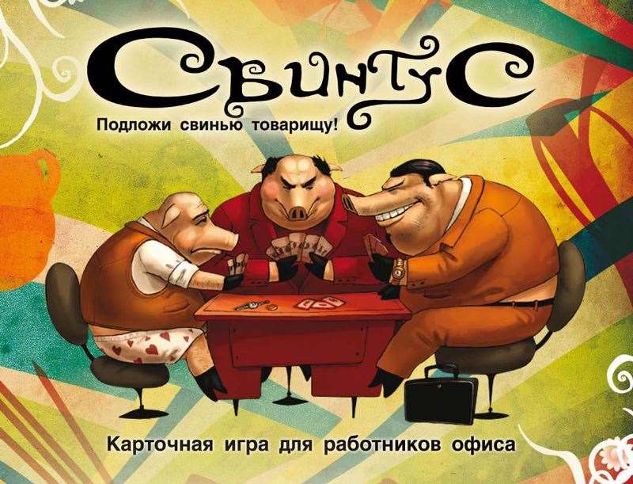
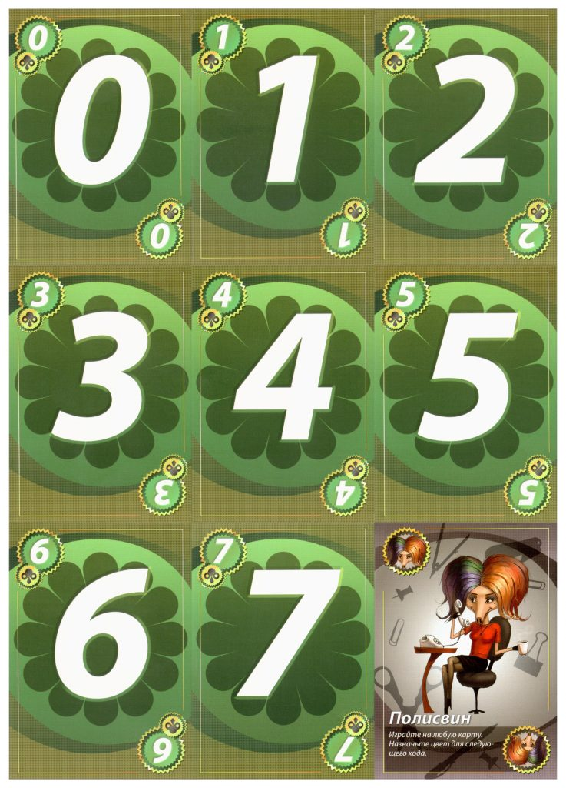
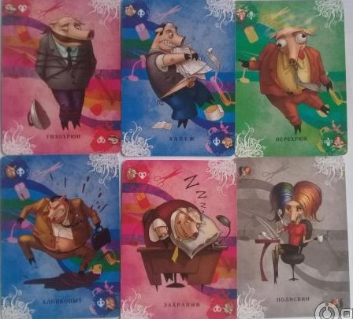

# RL Project "Swintus simulator"

## The game

Swintus (Piglet, in English meaning) is a fast-paced card game similar to Uno, with its own unique set of rules and
special cards. The game is
designed for 2-10 players, where the objective is to be the first to get rid of all the cards in your hand.

## Description of project

This project uses reinforcement learning to simulate the card game "Свинтус" (https://swintus.ru).
The goal is to create an intelligent agent that can learn to play the game well by practicing and adapting.
We want to see how well the agent can play "Свинтус".

## The environment

We can describe the environment using rules for the game.

Players take turns playing cards from their hand by matching the color or number of the top card on the discard pile.
Special action cards introduce unique effects, such as forcing players to skip turns, reverse the play order, or make
other players draw additional cards.

At the end, when a player has only one card left in their hand, they must shout "Swintus!" If they fail to do so and
another player notices, the player who forgot must draw additional cards as a penalty, adding an extra layer of strategy
and attention to the game. The first player to successfully play all their cards wins the game.

## The action space

The action space is the set of all possible actions that the agent can take in the environment. In this case, the agent
can make the following actions:

### Play a card

The game has several types of cards.

- **Regular cards**: These cards have a color and a number. To play a regular card, the agent must match the color or
  number
  of the top card on the discard pile.
- **Special cards**:
    - Skip (Захрапин): The next player in the turn order is skipped.
    - Reverse (Перехрюк): The play order is reversed.
    - Draw 3 (Хапеж): The next player must draw 2 cards.
    - Wild (Полисвин): The agent can play this card on any color.

Also, the game has two cards that we cannot implement in ordinal way:

- Silent Hush (Тихохрюн) Action: When the Silent Hush card is played, all players at the table must remain silent for
  one entire round. If anyone breaks this rule and speaks, they must draw two penalty cards.
- Cotton Paw (Хлопкопыт) Action: When the Cotton Paw card is played, all players must immediately place their hands on
  the deck. The last player to do so receives two penalty cards, adding an element of urgency and excitement to the
  game.

We are going to try to implement Cotton Paw card, but Silent Hush card is impossible to implement in the environment for
now.

### Draw a card

If the player cannot play any cards from their hand, they can choose to draw a card from the deck.

**Outcome**:

- If the drawn card can be played (matches the top card of the discard pile), the player has the option to play it
  immediately.
- If the drawn card cannot be played, the turn ends, and the next player takes their turn.

### Call "Swintus"

When a player has only one card left in their hand, they must shout "Svintus!" to alert other players.

**Important**: If a player forgets to call "Swintus" and another player notices, the player who forgot must draw
additional
two cards as a penalty.

## Preliminary reward function

For now, we can use the following reward function:

### Positive rewards

- Winning the game: _+100_

  When the agent successfully plays all its cards and wins the game.
- Playing a card: _+10_

  Each time the agent plays a valid card (regular or special) during its turn.
- Use of special card effectively: _+15_

  When the agent plays a special action card that benefits its strategy (e.g., skipping an opponent’s turn or making
  them draw cards).
- Drawing a Playable Card: _+5_

  When the agent draws a card from the deck that can be played immediately.

### Negative rewards

- Receiving Penalty Cards: _-10_

  When the agent receives penalty cards for forgetting to call "Swintus."
- Inability to Play: _-3_

  If the agent ends its turn without playing any cards (i.e., it has to draw a card without playing).

### Neutral rewards

- Playing a card that does not affect the game: _0_

  At the end of a turn, whether the agent played a card or not, to encourage learning about maintaining the game state
  without necessarily gaining or losing points.

## Timeline

Now, we research and define the state-space and action-space for the game. The next steps for the project are as
follows:

- Implement the basic RL framework and test the agent in the environment.
- Fine-tune the reward function and run more complex training simulations.
- Test and evaluate the agent’s performance in various game scenarios.

## Team

| Name                   | Innomail                          | Role                        |
|------------------------|-----------------------------------|-----------------------------|
| Apollinaria Chernikova | a.chernikova@innopolis.university | Data Scientist, RL Engineer |
| Egor Machnev           | e.machnev@innopolis.university    | RL Engineer, MLOps          |
