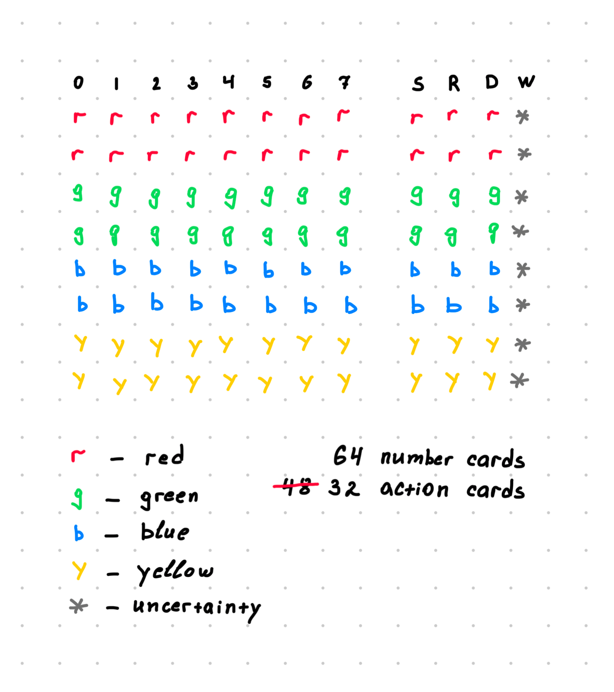
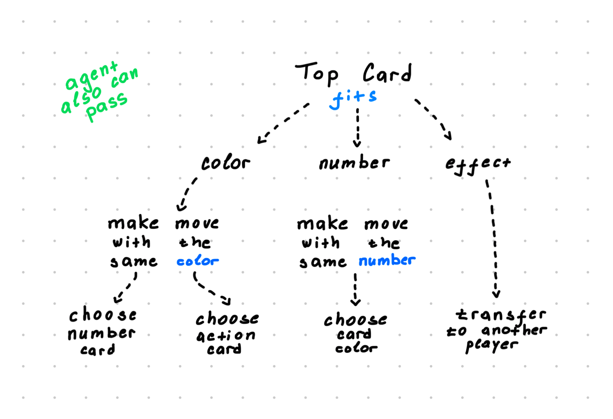
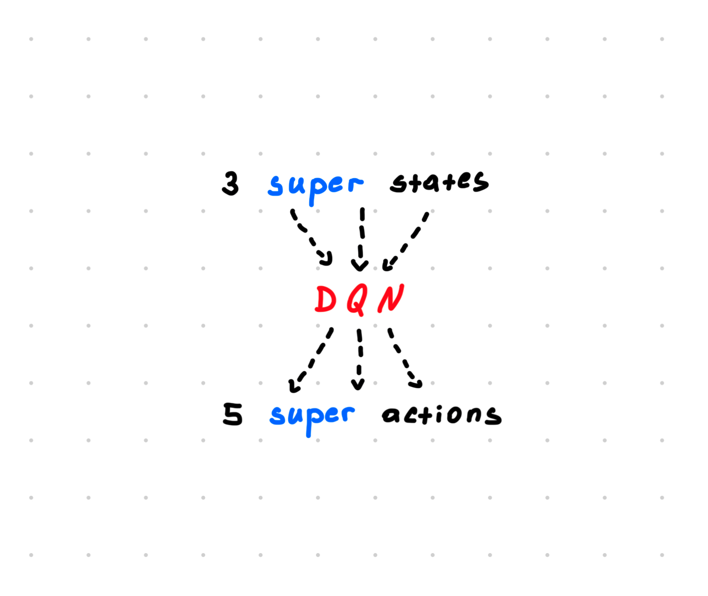
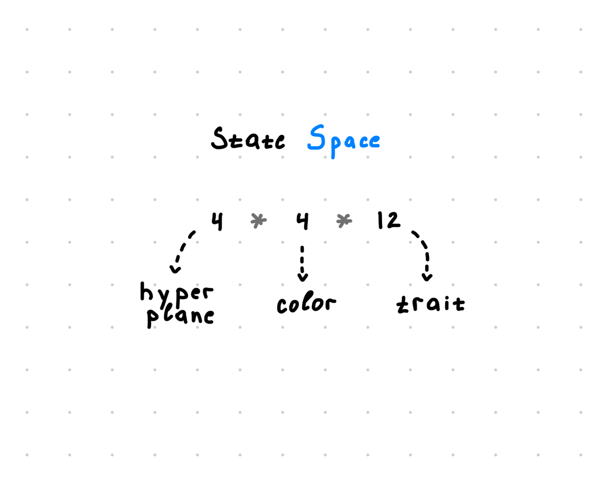
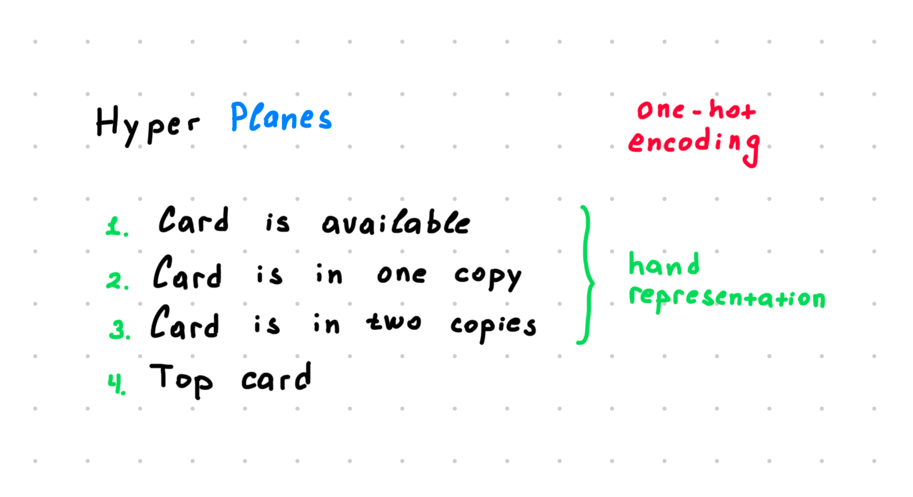
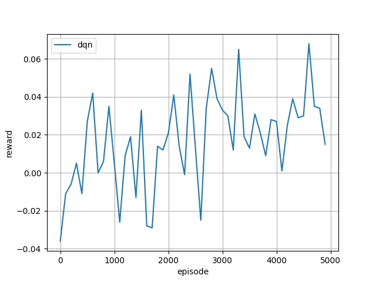

# Swintus Game

## Team Members

| Name                   | Innomail                          |
| ---------------------- | --------------------------------- |
| Egor Machnev           | e.machnev@innopolis.university    |
| Apollinaria Chernikova | a.chernikova@innopolis.university |

## Introduction

This project focuses on developing a reinforcement learning (RL) agent capable
of playing the Russian card game "Swintus" (Свинтус). The primary objective was
to design a simulation environment and an intelligent agent leveraging RL
techniques, specifically Deep Q-Networks (DQN), to master gameplay strategies
through interactions within the simulated environment. Our implementation
integrates custom-built environments with external frameworks to enhance the RL
agent's learning and decision-making capabilities.

## Related Work

Our project draws inspiration from several established frameworks and research
papers in the RL domain:

1. **RLCard Framework**: The RLCard library served as the foundation for
   building an adaptable RL-compatible environment tailored to Swintus.
   Modifications were made to accommodate the unique game rules.
2. **"Playing Atari with Deep Reinforcement Learning"**: The foundational work
   by Mnih et al. (2013) on DQN was instrumental in guiding the architecture and
   implementation of our agent.
3. **Additional References**:
   - _Deep Reinforcement Learning for General Game Playing_ (Foerster et al.,
     2017): Insights into multi-agent and strategic gameplay.
   - _Multi-Agent Reinforcement Learning in Sequential Social Dilemmas_ (Leibo
     et al., 2017): Relevant for multi-agent learning dynamics in Swintus.
   - _An Introduction to Deep Reinforcement Learning_ (Francois-Lavet et al.,
     2018): A comprehensive overview of RL methods.
   - _Experience Replay for Continual Learning_ (Rolnick et al., 2019):
     Experience replay techniques, which were critical for our DQN
     implementation.

These resources provided both theoretical and practical guidance throughout the
project.

## Methodology

### Card Types

Swintus features a variety of cards, categorized as follows:

1. **Number Cards**: Cards (0-7) in four colors: red, green, blue, and yellow,
   totaling 64 cards.
2. **Action Cards**: Special effect cards, such as Skip (S), Reverse (R), Draw 3
   (D), and Wild (W). Certain complex action cards, like Silent Hush (Тихохрюн)
   and Cotton Paw (Хлопкопыт), were excluded for simplicity.

### Decision Tree

The gameplay involves the following decision-making process:

1. Match the top card on the discard pile by color or number.
2. Play a special action card if applicable.
3. Draw a card from the deck if no valid moves exist.

This simplified decision tree enabled the RL agent to learn and optimize its
strategies effectively.

### Deep Q-Network Architecture

The RLCard-based DQN agent used three super states as input and predicted five
super actions. This abstraction reduced complexity, making the training process
more efficient.

### State Space Representation

We represented the state space using one-hot encoding to transform game states
into structured inputs. The dimensions included:

- **Hyperplanes (4)**: Indicators for card availability in the player's hand.
- **Colors (4)**: Representing the card colors.
- **Traits (12)**: Numeric and action-based card attributes.

### Hyperplanes

The hyperplanes encoded the agent's current hand and game state, including
indicators for:

1. A card's availability.
2. A card's occurrence in single or double copies.
3. The top card on the discard pile.

## Experiments and Evaluation

### Training and Performance

- **First Implementation**: Using TensorFlow, the initial training took over 21
  hours for 1000 episodes. However, this approach showed suboptimal results due
  to its architectural simplicity and inefficiency.
- **Second Implementation**: Transitioning to PyTorch and the RLCard framework
  improved training times and performance significantly. Training for 5000
  episodes demonstrated steady improvement despite natural fluctuations inherent
  to card games.

### Results and Insights

- Performance metrics for both implementations are available:
  - [TensorFlow results](experiments/tensorflow)
  - [RLCard DQN results](experiments/rlcard_dqn)
- To play with our agent, run [main.py](main.py).

## Analysis and Observations

1. **Training Efficiency**: Transitioning to PyTorch and RLCard enhanced
   scalability and reduced computational demands.
2. **Performance Trends**: While fluctuations occurred due to random opponents,
   the overall trend indicated strategic learning.
3. **Simplifications**: Excluding complex cards (e.g., Silent Hush and Cotton
   Paw) accelerated training while maintaining gameplay integrity.
4. **Environment Adaptation**: Successfully adapting Swintus rules to RLCard's
   DQN architecture highlighted the flexibility of modular frameworks.
5. **Future Potential**: Extended training episodes and the inclusion of more
   complex gameplay elements could further refine the agent's performance.

## Conclusion

This project successfully applied reinforcement learning techniques to the game
of Swintus. By leveraging RLCard's architecture, we developed an efficient
simulation environment. The DQN agent exhibited strong performance,
demonstrating adaptability and strategic gameplay even against non-random
opponents.

## Recommendations for Future Research

1. **Extended Training**: Additional training episodes to enhance performance
   and stability.
2. **Complex Rules**: Reintroducing omitted rules to test the agent's ability to
   handle intricate scenarios.
3. **Diverse Opponents**: Experimenting with heuristic-based or human players to
   assess robustness.
4. **Alternative Architectures**: Exploring PPO or Actor-Critic methods for
   comparative insights.
5. **Framework Scalability**: Adapting the Swintus environment to other RL
   frameworks for broader applicability.

## GitHub Link

The full implementation is available at the
[Swintus Simulator GitHub Repository](https://github.com/ApollyCh/Swintus-simulator).
